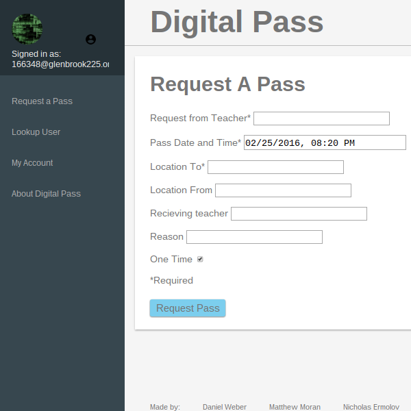
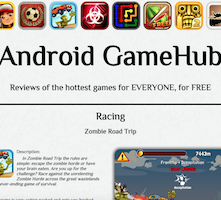
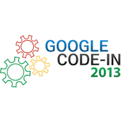

# Websites
## [Online Launchpad](https://agile-spire-1086.herokuapp.com/)
This is an online [Launchpad](http://global.novationmusic.com/launch/launchpad) that allows you to play a song by pressing keys on your keyboard. It is built using the Ruby on Rails framework and relies heavily on Javascript for the front-end. The GitHub repository for this project can be found [here](https://github.com/Dan12/Launchpad)

## [Game Design Host](https://lit-beyond-4450.herokuapp.com/)
This is a hosting service for Unity games that I created for my game design class. It is built using the Ruby on Rails framework. The GitHub repository for this project can be found [here](https://github.com/Dan12/GDHost).

## [Web AA](/aa)
This is my JavaScript version of an IOS and Android game called aa. After watching friends play this game on their iPhones, I really wanted to play it. However, I found out that the app didn't exist for Android phones at the time, so I decided to recreate the game so that I could play it. I initially created a JavaScript version of the game before porting the code to Android. I even released the app on the Google Play App Store, but unfortunately, the creators of the iPhone version asked me to take it down.

## [Digital Pass](https://epass.herokuapp.com/)
Ths is a digital pass app that I made with some of my friends. We created it because students at our school couldn't get to the engineering room during their lunch because they didn't have a hall pass. We hope to soon use this to replace some of the hall passes being written at our school. You can watch the demo video [here](https://www.youtube.com/watch?v=gpjaaxTlvOQ)

## [The Power of the Matrix](/thematrix)
After familiarizing myself with matrix transformations in my Linear Algebra class, I decided to learn WebGL, an API that allows you to draw 3D graphics using JavaScript. I then made this website to show how matrices are used in computer graphics to quickly and easily transform coordinates in 3D space and then convert those coordinates to 2D space to be displayed on the screen.

## [WebGL Animations](/WebGLTests)
After learning some of the basics about WebGL, I created 2 scenes and then tried to incorporate some animations into them. I also tried to learn a bit about shaders to create and animate light in the scenes. The results are pretty cool.

## [Android Gamehub](/final_project)
This is my final for my HTML and CSS Class which I took in the summer of 2013. It is supposed to be a mockup for a site that promotes and reviews android games.

## [Retro](/retro)
This is a web version of a Java game that I made. The Java game is actually one of the first games that I ever made. You can download the Java version from my GitHub [here](https://github.com/Dan12/retro).

## [Blackjack](/blackjack)
This is my recreation of the popular card game Blackjack, which I programmed in JavaScript. This was the first project that I created using JavaScript.

## [Space Flight](/flight)
This is my Javascript version of a Java game that I made inspired by the Helicopter Game. It is a fairly simple game played with the space bar.

## [Encoder](/encoder)
This is a text encoder that I made a few years ago as a fun side project. However, don't use it to encrypt your files because by today's standards it is very easy to break.

## [Image Slider](/img_slider)
This is an image slider that I made that can be downloaded and modified. I saw something similar on the web and tried to see if I could make my own.

# Other Projects
## [Android Apps](https://play.google.com/store/apps/developer?id=DanTech%20Apps&hl=en)
In the summer of 2014, I took an Introduction to Android Game Design class, which inspired me to continue writing apps. I have developed several android apps already and have even published some of them to the [Google Play App Store](https://play.google.com/store/apps/developer?id=DanTech%20Apps&hl=en). I have several other apps, mostly games, currently in development and will try to release them soon.

## [GitHub](https://github.com/Dan12)
I have a few other projects not listed here on GitHub. This includes several Ruby on Rails applications, a Machine Learning Library that I began writing in Java, and an original shape detection algorithm.

## [Research Paper](/daniel_weber_sirs_research_paper.pdf)
During my senior year of high school, I designed and carried out a research project on machine learning. I wanted to create a machine learning algorithm capable of learning visual features by looking at frames of a video. The algorithm that I ended up creating was different from traditional algorithms because it's dataset was constantly changing, which led to some interesting results. You can see my final paper [here](/daniel_weber_sirs_research_paper.pdf). Other research stuff [here](/research.html).

## [Music](https://soundcloud.com/doga1216)
I love music and I love messing around with it. I have a Numark Mixtrack Pro DJ controller and a Launchpad mini that I like to pull out every once in a while and just jam away at. I have also tried creating a remix, which turned out okay for a first try, and I have posted it to [Soundcloud](https://soundcloud.com/doga1216).

## [3D Modeling](https://www.youtube.com/watch?v=mYCbxSenAww)
I like to do some 3D modeling and animation whenever I have some free time. I mostly use [Maya](http://www.autodesk.com/products/maya/overview-dts?s_tnt=69290:1:0) and have created a few models and simulations to familiarize myself with the interface.

# Competitions
## [Square One AIVD Challenge](http://www.squareonenetwork.org/innovative-vehicle-design/autonomous-innovative-vehicle-design-challenge/)
In 2014, 2015, and 2016, I was part of a team that participated in Square One's Autonomous Innovative Vehicle Design Challenge. The goal of the competition was to re-engineer a small jeep, one that a little kid would ride in, to be completely autonomous and complete several predetermined tasks. In all 3 years, I did most of the coding for the car and helped out to varying degrees with the actual construction of the car. We enjoyed great successes in all 3 years, winning 3 first place trophies the first year for performance, design, and engineering, 2 first place trophies the second year in performance and ambassadorship, and 1 first place trophy in the third year for engineering. All of the code that I wrote and used in the 2016 competition can be found [here](https://github.com/Dan12/AIVD_2016)

## [ProCom 2.0](http://procom.strikingly.com/)
In February of 2016, I participated in the [ProCom 2.0](http://procom.strikingly.com/) programming competition. This programming competition required of teams of up to 4 students from a school to work together and solve up to 26 challenging programming problems. My school was able to get fourth place out of almost 30 teams, which was a great result for our school.

## [USACO Contests](http://www.usaco.org/)
I participated in [USACO's](http://www.usaco.org/) 2015-2016 contest season, my first season competing for USACO. While I did it mostly just for fun, I was able to make it up to the Gold Level in competition and was able to learn many interesting algorithms and programming techniques along the way.

## [Google Code Jam](https://code.google.com/codejam)
I participated in the Google Code Jam for the first time in 2015 and was able to qualify. I was one of 12,000 people worldwide to pass the qualifying round. Unfortunately, I was not able to make it passed round 1. I participated again in 2016, and despite performing better than in 2015, I did not make it past round 1.

## [Google Code In](https://developers.google.com/open-source/gci/?hl=en)
I participated in Google Code In in 2013 and completed a few HTML and JavaScript tasks for [Apertium](https://www.apertium.org/index.eng.html?dir=slv-srp#translation), which you can view [here](/google_code_in)

# Blog
## [Test Blog](test_blog)
This is some test input. I am just planning to use this as a test. [Lorem ipsum](http://www.lipsum.com/feed/html) dolor sit amet, consectetur adipiscing elit. Fusce molestie odio vel aliquet pretium. Donec interdum tortor a nisi imperdiet, ac ullamcorper orci sollicitudin. Pellentesque mi sem, accumsan id tellus sed, euismod fermentum lacus. Suspendisse nunc quam, pulvinar sed tellus ac, feugiat placerat purus. Proin dolor justo, sollicitudin vulputate ultricies id, vestibulum ut mi. Donec viverra felis nunc, nec elementum enim eleifend vitae. Donec porttitor lacinia facilisis. Fusce egestas, erat mattis ultricies ornare, mi ante sodales ipsum, vel euismod ipsum lectus efficitur massa. Curabitur eleifend, enim eu suscipit pellentesque, sapien ligula viverra ex, eu dapibus magna mi in quam.

Maecenas sed efficitur velit. Morbi at faucibus ex. Donec accumsan eu quam varius fermentum. Nam ultrices viverra elit, et dapibus ante sodales nec. Donec porta orci vel congue vehicula. Ut laoreet vitae dolor at malesuada. Fusce sed nulla sed nunc auctor euismod ut vel velit. Curabitur tempus neque et dui mollis, sed aliquet magna elementum. Mauris pretium urna nisl, eu vehicula velit accumsan lacinia. In ut arcu sed urna suscipit mollis.

Sed hendrerit metus in leo efficitur porttitor. Duis sagittis leo ut quam maximus rhoncus. Nullam purus dui, venenatis quis eros nec, blandit semper leo. Nunc vel metus pellentesque, volutpat nulla non, aliquam ligula. Vestibulum ante ipsum primis in faucibus orci luctus et ultrices posuere cubilia Curae; In eu [lorem ipsum](http://www.lipsum.com/feed/html) molestie, tristique dolor accumsan, vestibulum ante. Sed efficitur nunc eu tortor volutpat fermentum. Aliquam sagittis quis sem a vulputate. Nam condimentum eleifend nisi in mattis. Duis a libero est. Morbi a sagittis ligula, ut congue felis.

Sed imperdiet, tortor at mattis porta, ante sapien venenatis massa, vitae sodales orci mauris at nulla. Pellentesque habitant morbi tristique senectus et netus et malesuada fames ac turpis egestas. Nullam eget sem consequat, faucibus nulla a, fermentum libero. Proin ac porta metus. Maecenas et lacus tristique, porttitor justo non, blandit felis. Nulla nec scelerisque dui, eget pellentesque libero. Nam at auctor felis. In aliquam fermentum eleifend. Vivamus bibendum, tortor in semper pellentesque, sem metus euismod erat, ac ullamcorper urna libero sit amet quam.

Phasellus iaculis lacus ipsum, ut ultricies sapien eleifend at. Nulla in metus feugiat ipsum cursus placerat. Proin mollis bibendum diam. Vestibulum nulla urna, aliquam quis augue vitae, porttitor fermentum massa. Sed tincidunt commodo eleifend. Maecenas vitae mauris non lacus sodales maximus. Sed blandit ipsum sit amet blandit fringilla. Donec interdum orci velit, et dictum arcu mollis at. Nullam mattis arcu ac felis facilisis, ut tempus nunc ornare. Quisque mattis urna id porttitor ultrices. Ut ut malesuada ex. Fusce finibus, nulla nec suscipit iaculis, lectus risus fringilla ipsum, at varius risus lorem at massa. Nunc placerat justo eget tellus dictum blandit. Ut diam ligula, gravida at ligula vitae, elementum gravida magna.

# About
I am currently a freshman at [Cornell University](https://www.cornell.edu/) and I enjoy creating and building a wide range of projects. I focus mostly on electronics and programming projects. My favorite hobby is coding, and I have learned many different languages and have found many different applications for my knowledge. I consistently take programming related summer courses, mostly through Northwestern's [CTD](http://www.ctd.northwestern.edu/), and I have learned how to make web pages with HTML, CSS, and JavaScript and how to create database-backed applications using the Ruby on Rails framework.

I have also achieved significant proficiency in the Java programming language over many years of practice and application and have also gained a large amount of knowledge about Arduino programming and electronics. I also recently got a Raspberry Pi and have been experimenting with its GPIO capabilities. I recently took an online course through Coursera called [Machine Learning](https://www.coursera.org/learn/machine-learning), which was very interesting and has influenced me to study Machine Learning and Artificial Intelligence more in the future. This interest in Machine Learning influenced me to take another online course titled [Synapses, Neurons, and the Brain](https://www.coursera.org/learn/synapses). In addition to programming, I have also played soccer for over a decade on various teams and I have been doing Taekwondo for several years now.
