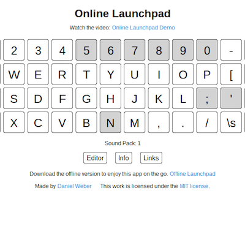
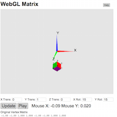
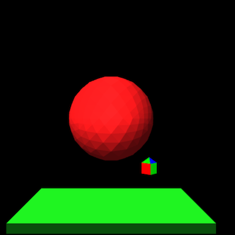
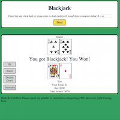
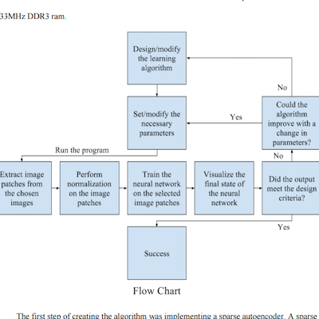
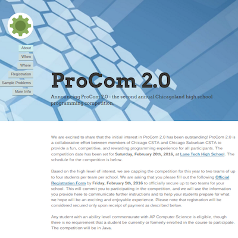

# Websites
## [Online Launchpad](https://agile-spire-1086.herokuapp.com/)
This is an online [Launchpad](http://global.novationmusic.com/launch/launchpad) that allows you to play a song by pressing keys on your keyboard. It is built using the Ruby on Rails framework and relies heavily on Javascript for the front-end. The GitHub repository for this project can be found [here](https://github.com/Dan12/Launchpad)

## [Game Design Host](https://lit-beyond-4450.herokuapp.com/)
This is a hosting service for Unity games that I created for my game design class. It is built using the Ruby on Rails framework. The GitHub repository for this project can be found [here](https://github.com/Dan12/GDHost).

## [Web AA](/aa)
This is my JavaScript version of an IOS and Android game called aa. After watching friends play this game on their iPhones, I really wanted to play it. However, I found out that the app didn't exist for Android phones at the time, so I decided to recreate the game so that I could play it. I initially created a JavaScript version of the game before porting the code to Android. I even released the app on the Google Play App Store, but unfortunately, the creators of the iPhone version asked me to take it down.

## [Digital Pass](https://epass.herokuapp.com/)
Ths is a digital pass app that I made with some of my friends. We created it because students at our school couldn't get to the engineering room during their lunch because they didn't have a hall pass. We hope to soon use this to replace some of the hall passes being written at our school. You can watch the demo video [here](https://www.youtube.com/watch?v=gpjaaxTlvOQ)

## [The Power of the Matrix](/thematrix)
After familiarizing myself with matrix transformations in my Linear Algebra class, I decided to learn WebGL, an API that allows you to draw 3D graphics using JavaScript. I then made this website to show how matrices are used in computer graphics to quickly and easily transform coordinates in 3D space and then convert those coordinates to 2D space to be displayed on the screen.

## [WebGL Animations](/WebGLTests)
After learning some of the basics about WebGL, I created 2 scenes and then tried to incorporate some animations into them. I also tried to learn a bit about shaders to create and animate light in the scenes. The results are pretty cool.

## [Android Gamehub](/final_project)
This is my final for my HTML and CSS Class which I took in the summer of 2013. It is supposed to be a mockup for a site that promotes and reviews android games.

## [Retro](/retro)
This is a web version of a Java game that I made. The Java game is actually one of the first games that I ever made. You can download the Java version from my GitHub [here](https://github.com/Dan12/retro).

## [Blackjack](/blackjack)
This is my recreation of the popular card game Blackjack, which I programmed in JavaScript. This was the first project that I created using JavaScript.

## [Space Flight](/flight)
This is my Javascript version of a Java game that I made inspired by the Helicopter Game. It is a fairly simple game played with the space bar.

## [Encoder](/encoder)
This is a text encoder that I made a few years ago as a fun side project. However, don't use it to encrypt your files because by today's standards it is very easy to break.

## [Image Slider](/img_slider)
This is an image slider that I made that can be downloaded and modified. I saw something similar on the web and tried to see if I could make my own.

# Other Projects
## [GitHub](https://github.com/Dan12)
I have several other projects not listed here on GitHub. This includes several Ruby on Rails applications, some simple games that I made, a slack bot, various attempts at computer vision and machine learning algorithms, and all of my scripts that don't contain sensitive information.

## [Android Apps](https://play.google.com/store/apps/developer?id=DanTech%20Apps&hl=en)
In the summer of 2014, I took an Introduction to Android Game Design class, which inspired me to continue writing apps. I have developed several android apps already and have even published some of them to the [Google Play App Store](https://play.google.com/store/apps/developer?id=DanTech%20Apps&hl=en). I have several other apps, mostly games, currently in development and will try to release them soon.

## [Research Paper](/daniel_weber_sirs_research_paper.pdf)
During my senior year of high school, I designed and carried out a research project on machine learning. I wanted to create a machine learning algorithm capable of learning visual features by looking at frames of a video. The algorithm that I ended up creating was different from traditional algorithms because it's dataset was constantly changing, which led to some interesting results. You can see my final paper [here](/daniel_weber_sirs_research_paper.pdf).

## [Music](https://soundcloud.com/doga1216)
I love music and I love messing around with it. I have a Numark Mixtrack Pro DJ controller and a Launchpad mini that I like to pull out every once in a while and just jam away at. I have also tried creating a remix, which turned out okay for a first try, and I have posted it to [Soundcloud](https://soundcloud.com/doga1216).

## [3D Modeling](https://www.youtube.com/watch?v=mYCbxSenAww)
I like to do some 3D modeling and animation whenever I have some free time. I mostly use [Maya](http://www.autodesk.com/products/maya/overview-dts?s_tnt=69290:1:0) and have created a few models and simulations to familiarize myself with the interface.

# Competitions
## [Square One AIVD Challenge](http://www.squareonenetwork.org/innovative-vehicle-design/autonomous-innovative-vehicle-design-challenge/)
In 2014, 2015, and 2016, I was part of a team that participated in Square One's Autonomous Innovative Vehicle Design Challenge. The goal of the competition was to re-engineer a small jeep, one that a little kid would ride in, to be completely autonomous and complete several predetermined tasks. In all 3 years, I did most of the coding for the car and helped out to varying degrees with the actual construction of the car. We enjoyed great successes in all 3 years, winning 3 first place trophies the first year for performance, design, and engineering, 2 first place trophies the second year in performance and ambassadorship, and 1 first place trophy in the third year for engineering. All of the code that I wrote and used in the 2016 competition can be found [here](https://github.com/Dan12/AIVD_2016)

## [ProCom 2.0](http://procom.strikingly.com/)
In February of 2016, I participated in the [ProCom 2.0](http://procom.strikingly.com/) programming competition. This programming competition required of teams of up to 4 students from a school to work together and solve up to 26 challenging programming problems. My school was able to get fourth place out of almost 30 teams, which was a great result for our school.

## [USACO Contests](http://www.usaco.org/)
I participated in [USACO's](http://www.usaco.org/) 2015-2016 contest season, my first season competing for USACO. While I did it mostly just for fun, I was able to make it up to the Gold Level in competition and was able to learn many interesting algorithms and programming techniques along the way.

## [Google Code Jam](https://code.google.com/codejam)
I participated in the Google Code Jam for the first time in 2015 and was able to qualify. I was one of 12,000 people worldwide to pass the qualifying round. Unfortunately, I was not able to make it passed round 1. I participated again in 2016, and despite performing better than in 2015, I did not make it past round 1.

## [Google Code In](https://developers.google.com/open-source/gci/?hl=en)
I participated in Google Code In in 2013 and completed a few HTML and JavaScript tasks for [Apertium](https://www.apertium.org/index.eng.html?dir=slv-srp#translation), which you can view [here](/google_code_in)

# Blog
## [Enrollment Push Messages with Firebase](push_messages) Jan. 12, 2017
This is a project that I started because I wanted to be notified when a class at Cornell opened up. During Cornell's add-drop period in the fall and spring, if you want to get into a class that is full, you have to constantly refresh the student center page until someone else drops the class and a spot opens up for you. A quick Google search did not reveal any already implemented notification systems. So I decided to try and see if I could set up a notification system for myself.

Because I do not have access to the student center backend, I had to work with the front end. I decided that I needed to try emulating refreshing the student center page from the command line, so I opened up [Postman](https://www.getpostman.com/) and captured my request to the student center enroll page. One of the nice things about postman is that it shows you the cookies that were sent with a request, which is what I need to "log in" from the command line.

After I had the cookie, I set up a simple Node.js script that would send a get request to the student center URL with the cookie in the header of the request. I then parsed the response from the server to find the specific class that I wanted to enroll in and check if there was a spot open (I basically used the image tag, so hopefully they won't change that). After I could tell if a class was open or not from the command line, I wanted to know if I could send a push notification to my phone. A quick google search revealed that Google's [Firebase](https://firebase.google.com/) offered a simple and more importantly free API for sending push notifications to a phone. After following the firebase app setup for android and slightly customizing it for my purpose, I added an HTTP request to the Firebase API to my class checking script that would send a push message to a device specified by a token.

I thought that I was done after this, but I realized that I would be carrying around my laptop and it sleeps whenever the screen is closed. I needed to find a preferably free service that would allow me to run a small secure script in the cloud. After experimenting with a few online IDE's, I realized that most of them sleep after some amount of inactivity. I finally remembered the [Beep Boop](https://beepboophq.com/) Slack bot service that I had used at my internship at Occasion. Their free plan runs a small docker container in the cloud that you can hook into with slack. So I downloaded Beep Boop's node started bot, set up a simple listener for a `start script` command in slack, and plugged in my existing push notification code.

After setting up the private environment variables for the bot (such as my cookie and Firebase api key), I started it up, and it worked. The only downside is that I have to reenter my cookie every day, as it expires after about a 24 hours. The other thing that I realized about this is that I didn't really have to do the whole Firebase setup, because the slack app will send you push notifications when you get a direct message. Nevertheless, it was still fun to get exposed to Firebase and I am definitely interested in the other services. I also realized that I could extend the push notification system to arbitrary tasks, so I went back to the push notification code base and made it more general. You can find that code [here](https://github.com/Dan12/Personal-Push-Messages). I tried to include a little tutorial on how to get started with Firebase how to set up the android app. The slack bot code can be found [here](https://github.com/Dan12/starter-node-bot).

# About
I am currently a sophomore enrolled at [Cornell University](https://www.cornell.edu/) pursuing a Bachelors degree in Computer Science. I currently have a wide variety of passions in the realm of computer science. I have joined [Cornell's Hacking Club](https://chc.cs.cornell.edu/) and enjoy the pwning and reverse engineering challenges in the CTF's that we participate in. I am pursuing my love for robotics and intelligent systems on the [Cornell Cup Robotics Team](http://cornellcuprobotics.com/), where I am one of the members on the computer vision team. I have also greatly enjoyed the projects assigned to me in the various programming classes that I take. I have designed a working pipelined MIPS processor, cooperatively architected a large thread safe critter simulator with a GUI, implemented libc's malloc, and written complex inductive proofs. And that was just my first year. This year I plan to write my own operating system, learn a functional programming language, create a compiler, and learn more about algorithms, data structures and writing good code than I ever thought was possible.

During my Pre-Collegiate years, I took several programming related summer courses, mostly through Northwestern's [CTD](http://www.ctd.northwestern.edu/). That's where I learned how to make web pages with HTML, CSS, and JavaScript and how to create database-backed applications using the Ruby on Rails framework. I also had many software side projects that I worked on, many of which are on display on this site, and I pursued my love for engineering by creating several hardware projects in my high school's engineering club. The most notable example of this was the Square One AIVD challenge, which introduced me to many new technologies and gave me an appreciation for electrical and mechanical engineering. I have a great love for learning and I am always looking to expand my knowledge and learn more about subjects that really interest me, which has led me to some fascinating Massive Open Online Courses (MOOCs).

The first MOOC that I took was Coursera's [Machine Learning](https://www.coursera.org/learn/machine-learning), course, which was very interesting and has inspired me to study Machine Learning and Artificial Intelligence more in the future. My interest in Machine Learning also led me to another online course titled [Synapses, Neurons, and the Brain](https://www.coursera.org/learn/synapses). I also have learned about Node.js and MongoDB from a [server side development](https://www.coursera.org/learn/server-side-development) course.

In addition to programming, I have also played soccer for over a decade on various teams and I have been doing Taekwondo for several years now. Some of my hobbies include juggling, rock climbing, music, and electronics. I also occasionally dabble in video editing and 3D modeling.
